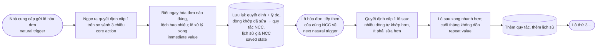

# Track1_Day20 — Product Metrics Pack

- **Họ tên:** Nguyễn Quang Huy · **MHV:** 2A202602421
- **Dự án:** P-143 — Đối soát hóa đơn 3 chiều (hóa đơn mua vào ↔ đơn đặt hàng ↔ phiếu nhập kho), đội Fantastic4, AI20K
- **Use case phân tích:** kế toán viên xử lý hóa đơn mua vào hằng ngày cho tới khi hóa đơn được duyệt để thanh toán

Chuỗi quyết định của bài: **core action → nhịp tự nhiên → bộ metric + retention → loop (giả thuyết) → tracking (phép thử)**.
Mọi con số ngưỡng trong bài (14 ngày, 20 hóa đơn, 2 ngày làm việc…) là **giả định ban đầu** để đo được ngay; chúng
được hiệu chỉnh bằng dữ liệu cohort của pilot, không lấy từ benchmark bên ngoài.

---

## 00 — Dự án, persona, core job

| Mục | Nội dung |
|---|---|
| **Dự án** | P-143: hệ thống nhận hóa đơn mua vào (XML điện tử, PDF, ảnh scan), tự trích xuất, tìm PO và phiếu nhập kho, khớp từng dòng, chỉ ra từng khoản lệch bằng con số, rồi đưa kế toán duyệt 1–2 cấp. Đã có MVP chạy được. |
| **Persona** (một) | **Ngọc, kế toán viên công nợ phải trả** ở một công ty phân phối phụ tùng (~100 nhân sự). Mỗi ngày nhận 20–40 hóa đơn qua email và bản cứng; cuối tháng dồn khoảng 300 hóa đơn trong 3 ngày (PRD §2.1). Đối chiếu bằng Excel và thư mục phiếu nhập. |
| **Core job** (lời người dùng) | *"Mỗi hóa đơn nhà cung cấp gửi về, tôi phải chắc nó khớp với hàng đã đặt và hàng đã nhận trước khi cho thanh toán. Hiện tôi mất cả ngày so tay từng dòng, cuối tháng vẫn dồn, và tôi sợ nhất là duyệt nhầm một hóa đơn giá cao hơn PO rồi bị hỏi lúc quyết toán."* |

---

## 01 — Core Action Card

### Phân biệt bốn khái niệm

| Khái niệm | Câu hỏi | Dự án của tôi |
|---|---|---|
| Core job | User đang cố hoàn thành việc gì? | Xác nhận hóa đơn mua vào đúng với PO và phiếu nhập trước khi thanh toán, không duyệt nhầm |
| Core action | User làm gì trong sản phẩm để tiến tới giá trị? | **Ra quyết định cấp 1 cho một hóa đơn đã được đối chiếu** (duyệt / trả lại / từ chối) dựa trên bảng so sánh 3 chiều |
| Core value | User nhận được lợi ích gì? | Biết ngay hóa đơn nào yên tâm duyệt, chỗ nào lệch và lệch bao nhiêu; hóa đơn được xử lý xong nhanh, có bằng chứng để giải trình |
| Core value event | Sự kiện nào chứng minh value đã xảy ra? | `invoice_approved` (hóa đơn tới trạng thái đã duyệt và **không bị đảo** sau đó) — hoặc hóa đơn sai bị trả lại / từ chối kèm lý do có số liệu |

Core action và core value event **không trùng**: quyết định cấp 1 là hành vi của Ngọc; giá trị chỉ chắc chắn khi hóa
đơn đi hết đường duyệt (có thể qua cấp 2) mà không bị trả ngược — giống "bấm đặt xe" khác "chuyến xe hoàn thành".

### Core Action Card

| Thành phần | Câu trả lời |
|---|---|
| **Target user** | Kế toán viên công nợ phải trả (Ngọc) |
| **Core job** | Chắc mỗi hóa đơn mua vào khớp PO và phiếu nhập trước khi thanh toán, không duyệt nhầm |
| **Core action** | Ra **quyết định cấp 1** (duyệt / trả lại / từ chối) cho **một hóa đơn đã đối chiếu xong**, trên màn so sánh 3 chiều |
| **Object** | Một hóa đơn mua vào ở trạng thái `PENDING_L1` (đã trích xuất, đã tìm PO và phiếu nhập, đã xếp 🟢 / 🟡 / 🔴) |
| **Preconditions** | Hóa đơn đã được tải lên và đối chiếu; PO và phiếu nhập của nhà cung cấp đã có trong hệ thống; Ngọc có quyền KTV trong tổ chức |
| **Completion rule** | Một bản ghi duyệt cấp 1 được lưu (`approvals.level = 1`, có `decision`) **và** hóa đơn rời `PENDING_L1` (sang `PENDING_L2`, `APPROVED`, `RETURNED` hoặc `REJECTED`). Trả lại / từ chối phải có lý do ≥ 10 ký tự. Mở màn so sánh hay bấm nút mà bị chặn (`409`, `403`) **không** tính. |
| **Core value** | Không phải tự so từng dòng; biết chắc hóa đơn nào duyệt được, chỗ nào lệch bao nhiêu; xử lý xong hóa đơn trong ngày, cuối tháng không dồn |
| **Evidence of value** | Hóa đơn tới `APPROVED` mà không bị cấp 2 trả lại và không bị sửa trường sau duyệt; thời gian từ tải lên đến quyết định cấp 1 ngắn lại theo từng lô |
| **Candidate event** | `invoice_l1_decided` (core action) → `invoice_approved` (core value event) |

### Tự kiểm 5 tiêu chí

| # | Tiêu chí | Kết quả | Lý do |
|---|---|---|---|
| 1 | Gần core value | ✅ | Quyết định duyệt / trả lại **chính là** việc Ngọc phải làm cho core job; sau hành vi này hóa đơn đã xong phần của cô ấy |
| 2 | Có thể lặp lại | ✅ | Lặp lại với mỗi hóa đơn nhà cung cấp gửi về — vài chục lần mỗi ngày làm việc |
| 3 | Có thể quan sát | ✅ | Completion rule đo được tuyệt đối: một dòng `approvals` cấp 1 + chuyển trạng thái được ghi audit |
| 4 | Có ý nghĩa | ✅ (có điều kiện) | Nhiều quyết định đúng hơn trong cùng thời gian = sản phẩm tốt hơn. Điều kiện: quyết định không bị đảo — nên NSM có quality threshold và có counter-metric "duyệt nhầm" (mục 03) |
| 5 | Có thể tác động | ✅ | Team tác động trực tiếp: khớp PO / dòng chính xác hơn, giải thích lệch rõ hơn, OCR tốt hơn, quy tắc nhớ theo nhà cung cấp |

**5/5 — qua Gate 1.** Vì sao **không phải** các ứng viên khác:

| Ứng viên | Loại | Vì sao loại |
|---|---|---|
| Đăng nhập / mở trang hóa đơn | Thao tác giao diện | Không tạo ra giá trị nào; mở ra rồi đóng lại vẫn chưa xử lý được hóa đơn |
| Tải hóa đơn lên | Đầu vào | Là bước nạp dữ liệu, số lượng do nhà cung cấp quyết định chứ không do giá trị sản phẩm |
| Hệ thống xếp 🟢 / 🟡 / 🔴 | **Output hệ thống** | AI / luật tạo ra kết quả chưa có nghĩa là Ngọc đã dùng nó để quyết định |
| "Hỏi AI" về một hóa đơn | Thao tác giao diện | P-143 không có chatbot; kể cả có, hỏi không phải là xong việc |
| Hóa đơn được duyệt cấp 2 | Hành vi của persona khác (KTT) | Thuộc use case khác; dùng làm phần quality của value event, không làm core action của KTV |

---

## 02 — Action Nature Card + kết luận cadence

### Action Nature Card

| Thành phần | Trả lời |
|---|---|
| **Actor** | Kế toán viên (user), làm việc trong **tổ chức** (account): các KTV trong cùng phòng chia nhau hóa đơn, KTT duyệt cấp 2 |
| **Intent** | Cho phép thanh toán đúng hóa đơn đúng, chặn hóa đơn sai, trước hạn thanh toán và trước khi khóa sổ tháng |
| **Trigger** | **Sự kiện bên ngoài**: nhà cung cấp gửi hóa đơn (email, bản cứng, cổng hóa đơn điện tử). Phụ: kỳ thanh toán của công ty và mốc khóa sổ cuối tháng. Hệ thống chỉ báo "đã đối chiếu xong", không tự sinh nhu cầu |
| **Effort** | Hóa đơn 🟢: vài giây (xem nhanh, duyệt). 🔴: vài phút tới vài ngày (xem khoản lệch, có thể phải hỏi nhà cung cấp, trả lại). Dữ liệu cần: PO và phiếu nhập đã nạp |
| **Value timing** | **Ngay** cho từng hóa đơn (biết chắc đúng / sai, xong việc); **tích lũy** theo kỳ (cuối tháng không dồn, sổ sạch khi quyết toán, có bằng chứng khi kiểm toán) |
| **State** | Bản ghi duyệt + lý do; các khoản lệch đã xử lý; lịch sử giá theo nhà cung cấp; **quy tắc nhớ theo nhà cung cấp** (tên hàng ↔ mã hàng, quy đổi đơn vị) học từ lần Ngọc sửa dòng khớp sai |
| **Dependency** | Nguồn cung hóa đơn (nhà cung cấp gửi khi nào); PO và phiếu nhập phải có trước (kho nhập hàng xong mới có phiếu); KTT cho hóa đơn cần cấp 2; mốc thanh toán / khóa sổ |
| **Repeat condition** | Có hóa đơn mới về; một hóa đơn bị trả lại đã được sửa và đối chiếu lại; mốc khóa sổ cuối tháng làm khối lượng dồn lên |

### Dạng hành vi

**Phản ứng theo sự kiện** — core action chỉ có lý do xảy ra khi có hóa đơn mới về (hoặc hóa đơn bị trả lại quay về),
và tần suất do nhà cung cấp quyết định chứ không do thói quen của Ngọc. Có cao điểm theo chu kỳ tháng (khóa sổ), nhưng
nhu cầu gốc là sự kiện.

### Kết luận cadence

> Đối với **kế toán viên công nợ phải trả của một doanh nghiệp mua hàng theo PO**, core action **ra quyết định cấp 1 cho
> một hóa đơn đã đối chiếu** thường xuất hiện **theo từng đợt trong mỗi tuần làm việc, mỗi khi nhà cung cấp gửi hóa đơn
> về, và dồn lên ở mốc khóa sổ cuối tháng** vì **nhu cầu chỉ sinh ra khi có hóa đơn mới phải xử lý trước hạn thanh toán
> — không có hóa đơn về thì không có việc gì để làm**. Do đó, nhịp đo phù hợp là **tuần làm việc (thứ Hai – thứ Sáu,
> giờ Việt Nam), chỉ tính những tuần có hóa đơn về,** ở cấp **tổ chức (account)**; tốc độ xử lý đo ở cấp **hóa đơn**.

**Vì sao không chọn nhịp khác:**

- **Không daily:** một ngày không có hóa đơn về mà Ngọc không vào hệ thống là **bình thường**, không phải dấu hiệu rời
  bỏ. DAU sẽ dao động theo lịch nhà cung cấp gửi hóa đơn chứ không theo giá trị sản phẩm (luật 3: không ép daily).
- **Không monthly làm nhịp chính:** một tháng quá thưa cho một công cụ xử lý công việc hằng tuần; để biết Ngọc quay lại
  Excel phải đợi cả tháng. Mốc tháng chỉ dùng phụ, để xem khóa sổ có còn dồn không.
- **Cấp tổ chức, không cấp user:** hóa đơn được chia giữa các KTV, người nghỉ phép thì người khác xử lý thay. Một user
  vắng một tuần chưa nói lên điều gì; **cả phòng** không xử lý hóa đơn trong hệ thống nữa mới là mất khách.
- **Frequency cao hơn ≠ value cao hơn:** số quyết định mỗi tuần do lượng hóa đơn quyết định. Với sản phẩm này, **xử lý
  xong nhanh hơn, ít phải sửa hơn** mới là tín hiệu tốt — vì vậy NSM đo hóa đơn được xử lý đúng và kịp, không đo số lượt
  dùng.

---

## 03 — Metric System

### Activation

| Thành phần | Định nghĩa |
|---|---|
| **Start event** | Tổ chức tải **hóa đơn đầu tiên** lên (`invoice_uploaded` đầu tiên của `org_id`). Điều kiện kèm: đã nạp PO và phiếu nhập (nếu chưa, hóa đơn sẽ báo thiếu chứng từ — đó là lỗi setup, không phải activation thất bại) |
| **Activation event** | Tổ chức có **≥ 20 hóa đơn được ra quyết định cấp 1** (`invoice_l1_decided`) **trên hóa đơn đã đối chiếu có PO** (không phải hóa đơn FAILED / nhập tay), **trải ra ≥ 2 tuần làm việc khác nhau** |
| **Time window** | **14 ngày** kể từ start event (đủ 2 tuần làm việc để nhà cung cấp gửi đợt hóa đơn thứ hai) |

Vì sao định nghĩa vậy (Active ≠ Activated, S26):

- **Không** dùng "đăng nhập", "xem hết hướng dẫn", "tải hóa đơn đầu tiên": chưa chạm core value.
- **Không** dùng "1 quyết định đầu tiên" làm activation: một lần duyệt thử chưa chứng minh Ngọc đã chuyển việc đối chiếu
  từ Excel sang hệ thống. 20 hóa đơn ≈ khối lượng 1 ngày làm việc (PRD: 20–40 hóa đơn/ngày); **2 tuần khác nhau** chứng
  minh đã **lặp lại** khi đợt hóa đơn sau về.
- 20 và 14 ngày là giả định; sẽ hiệu chỉnh bằng cách so retention tuần 4–8 giữa các nhóm "đạt / không đạt" ngưỡng trên
  dữ liệu pilot, chọn ngưỡng tách hai nhóm rõ nhất.

### Engagement (2 góc đo)

| Góc | Metric | Cách tính |
|---|---|---|
| **Depth — độ phủ** | **Tỷ lệ hóa đơn được xử lý trong hệ thống** | Hóa đơn có `invoice_l1_decided` ÷ hóa đơn `invoice_uploaded`, theo tổ chức, mỗi tuần làm việc. Cho biết Ngọc xử lý **cả lô** trong P-143 hay chỉ thử vài hóa đơn rồi quay lại Excel |
| **Frequency — đúng nhịp** | **Số tuần làm việc có hoạt động / số tuần có hóa đơn về** (trong 4 tuần gần nhất) | Tuần có ≥ 1 `invoice_l1_decided` ÷ tuần có ≥ 1 `invoice_uploaded`. Đo theo nhịp tự nhiên của mục 02: tuần không có hóa đơn về không bị tính là "không dùng" |

### North Star Metric

> **Số hóa đơn mua vào được ra quyết định cấp 1 trong vòng 2 ngày làm việc kể từ khi tải lên và không bị đảo quyết định
> sau đó, mỗi tuần làm việc, trên mỗi tổ chức.**

| Thành phần | Trong NSM |
|---|---|
| **Unit of value** | Một hóa đơn mua vào được ra quyết định (đúng hay sai đều được xác định rõ) — đơn vị chính của core job |
| **Quality threshold** | (a) Quyết định cấp 1 trong **≤ 2 ngày làm việc** từ lúc tải lên — kịp kỳ thanh toán, cuối tháng không dồn; (b) **không bị đảo**: không bị KTT trả lại ở cấp 2 và không bị sửa trường sau khi đã duyệt, trong 30 ngày sau quyết định |
| **Frequency** | Mỗi tuần làm việc (theo mục 02) |

Vì sao NSM không phải "số hóa đơn tải lên" hay "số lượt dùng": tải lên phụ thuộc nhà cung cấp; lượt dùng tăng khi sản
phẩm **tệ hơn** (phải mở đi mở lại một hóa đơn). Ngưỡng "không bị đảo" ngăn việc tăng NSM bằng cách bấm duyệt mù.

### Leading indicators (tối đa 3)

| # | Leading indicator | Vì sao tin nó dự báo core action lặp lại |
|---|---|---|
| 1 | **Tỷ lệ hóa đơn tự tìm được PO** (không cần người ghép PO bằng tay) trong 2 tuần đầu | Khi hệ thống tự ghép đúng, phần lớn hóa đơn 🟢 duyệt trong vài giây — Ngọc thấy rõ thời gian tiết kiệm so với Excel nên có lý do xử lý lô tiếp theo trong hệ thống. Nếu phải ghép tay nhiều, hệ thống chậm hơn Excel và cô ấy sẽ quay về |
| 2 | **Số quy tắc theo nhà cung cấp được kích hoạt** (tên hàng ↔ mã hàng, quy đổi đơn vị) trong 4 tuần đầu | Đây là **khoản đầu tư** (saved state): mỗi quy tắc làm lô hóa đơn sau của cùng nhà cung cấp khớp tự động hơn. Càng nhiều quy tắc, chi phí chuyển về Excel càng cao và lần sau càng nhanh |
| 3 | **Tỷ lệ hóa đơn về khi PO và phiếu nhập đã có sẵn** (không báo thiếu chứng từ `DOC-01/02`) | Hóa đơn về mà thiếu PO / phiếu nhập thì không thể ra quyết định — Ngọc kẹt, phải hỏi kho, phải làm ngoài hệ thống. Dữ liệu sẵn sàng thì core action mới có điều kiện xảy ra đúng nhịp |

### Counter-metrics

| Counter-metric | Phát hiện điều gì | Cách tính |
|---|---|---|
| **Tỷ lệ duyệt nhầm** | NSM tăng vì Ngọc **bấm duyệt mù** cho nhanh | Hóa đơn đã duyệt cấp 1 mà sau đó bị KTT trả lại ở cấp 2, hoặc bị phát hiện lệch / sửa trường sau duyệt ÷ hóa đơn đã duyệt cấp 1. Không được tăng khi NSM tăng |
| **Tỷ lệ hóa đơn phải nhập tay hoặc FAILED** | Đẩy nhanh bằng cách bỏ qua hóa đơn khó (PDF mờ, trang trắng) | Hóa đơn `FAILED` / nhập tay ÷ hóa đơn tải lên, theo định dạng (XML / PDF / ảnh) |
| **Chi phí AI mỗi hóa đơn** | Chất lượng đọc PDF / ảnh tăng nhờ đọc nhiều lần, model đắt hơn | `processing_cost_usd` trung bình mỗi hóa đơn ảnh / PDF (đã có trong P-143); ngân sách theo ngày |

---

## 04 — Retention Definition

| Thành phần | Định nghĩa | Khớp với cadence ở mục 02 |
|---|---|---|
| **Unit** | **Tổ chức** (`org_id`) | Hóa đơn được chia giữa các KTV; cả phòng bỏ hệ thống mới là churn |
| **Cohort entry** | **Tuần làm việc tổ chức đạt activation** (mục 03) | Chỉ tính tổ chức đã thật sự chạm value, không tính tổ chức đăng ký rồi bỏ |
| **Return event** | `invoice_l1_decided` trên hóa đơn đã đối chiếu (core action) | Đúng hành vi tạo value, không phải đăng nhập hay tải lên |
| **Window** | **Tuần làm việc** (thứ Hai – thứ Sáu, `Asia/Ho_Chi_Minh`), tuần 1…8 sau cohort entry. **Bỏ khỏi mẫu số** những tuần tổ chức không có hóa đơn nào về (custom bracket) | Nhịp phản ứng theo sự kiện: tuần không có hóa đơn về không có lý do để quay lại |
| **Threshold** | Xử lý **≥ 50% số hóa đơn về trong tuần** (và ≥ 1 quyết định) | Một quyết định lẻ chưa chứng minh tổ chức còn dùng hệ thống cho công việc thật; xử lý phần lớn lô mới chứng minh |
| **Segment** | Doanh nghiệp mua hàng theo PO, có phiếu nhập kho, phần lớn hóa đơn là XML điện tử; KTV công nợ phải trả (persona Ngọc) | Đúng persona mục 00 |

**Định nghĩa một câu:** *Tỷ lệ tổ chức thuộc cohort tuần activation W có ≥ 1 `invoice_l1_decided` và xử lý ≥ 50% số
hóa đơn về trong tuần làm việc thứ N (N = 1…8, chỉ tính các tuần có hóa đơn về), segment doanh nghiệp mua hàng theo PO
dùng hóa đơn điện tử.*

**Kiểm tra phụ theo chu kỳ tháng:** ở tuần khóa sổ, tỷ lệ hóa đơn trong tháng được ra quyết định trước ngày khóa sổ.
Đây là cách xem "cuối tháng có còn dồn không" — không dùng làm retention chính.

**So với ba mốc (S34) thay vì một con số cứng:**

1. **Nhịp tự nhiên:** retention tuần không thể cao hơn tỷ lệ tuần có hóa đơn về — đã khử bằng cách bỏ tuần không có
   hóa đơn khỏi mẫu số.
2. **Cohort cùng segment:** so cohort tháng này với cohort tháng trước cùng segment (khi có ≥ 2 cohort pilot).
3. **Benchmark ngành:** **chưa có số liệu có nguồn** cho phần mềm đối soát hóa đơn ở Việt Nam. Không đặt mục tiêu từ số
   "tham khảo"; khi có pilot sẽ dùng mốc 1 và 2.

---

## 05 — Product Loop

**Loại loop chính:** **workflow loop** (vòng công việc lặp theo lô hóa đơn), có phần **đầu tư** nằm ở quy tắc nhớ theo
nhà cung cấp làm vòng sau nhanh hơn vòng trước.

Chu kỳ viết thành chữ:

1. **Natural trigger:** nhà cung cấp gửi hóa đơn, có hạn thanh toán.
2. **Core action:** Ngọc ra quyết định cấp 1 trên màn so sánh 3 chiều (sửa dòng khớp sai nếu có).
3. **Immediate value:** biết ngay hóa đơn nào yên tâm duyệt, chỗ nào lệch bao nhiêu; lô xử lý xong trong ngày.
4. **Saved state / investment:** quyết định và lý do được lưu; mỗi lần sửa dòng khớp sai đề xuất một quy tắc theo nhà
   cung cấp (tên hàng ↔ mã hàng); lịch sử giá của nhà cung cấp dày lên.
5. **Next natural trigger:** lô hóa đơn tiếp theo của **cùng nhà cung cấp** về (thường trong tuần hoặc tuần sau).
6. **Core action tiếp theo:** nhờ quy tắc đã học, nhiều dòng tự khớp, nhiều hóa đơn 🟢 hơn, ít phải sửa hơn.
7. **Repeat value:** lô sau xong nhanh hơn lô trước; cuối tháng không dồn.

**Reason to return nếu bỏ notification:** hóa đơn vẫn tiếp tục về và **phải** được xử lý trước hạn thanh toán và trước
khóa sổ — nhu cầu có thật ngoài sản phẩm. Hệ thống chỉ nói "lô đã đối chiếu xong" (nurture khuếch đại nature), không tạo
ra lý do quay lại.

**Metric hypothesis:**

> Nếu loop này hoạt động, metric **NSM — số hóa đơn được quyết định cấp 1 trong ≤ 2 ngày làm việc và không bị đảo, mỗi
> tuần, mỗi tổ chức** (cùng với thời gian trung vị từ tải lên đến quyết định cấp 1 của các nhà cung cấp lặp lại) sẽ thay
> đổi theo hướng **tăng (thời gian trung vị giảm) từ lô thứ 1 đến lô thứ 4 của cùng một nhà cung cấp** trong **6 tuần
> làm việc đầu sau activation**, vì **mỗi lần Ngọc sửa dòng khớp sai ở lô trước tạo một quy tắc theo nhà cung cấp, quy
> tắc đó được áp dụng tự động ở lô sau nên lô sau có nhiều hóa đơn 🟢 hơn và cần ít thao tác hơn**.

Cách bác bỏ giả thuyết: nếu sau 6 tuần, tỷ lệ dòng tự khớp và thời gian xử lý của nhà cung cấp lặp lại **không** tốt
lên so với nhà cung cấp mới, thì phần "đầu tư" của loop không hoạt động — loop chỉ còn là workflow, cần xem lại cơ chế
học quy tắc.

---

## 06 — Tracking nhanh

| # | Tên event | Ý nghĩa (điều đã xảy ra) | Thời điểm ghi nhận | Metric sử dụng (mục 03 / 04) |
|---|---|---|---|---|
| 1 | `invoice_uploaded` | Một hóa đơn **mới** đã được nhận và lưu (file hợp lệ, không trùng file đã có) | Khi transaction tạo hóa đơn ở trạng thái `UPLOADED` commit xong — **không** bắn khi file bị từ chối hoặc trùng | Start event của activation; mẫu số Depth; mẫu số "tuần có hóa đơn về" (Frequency, Retention window) |
| 2 | `invoice_reconciled` | Hóa đơn đã được đối chiếu xong và xếp loại (có / không tìm được PO tự động) | Khi hóa đơn chuyển sang `PENDING_L1` (property: `classification`, `po_matched_by`) | Leading indicator 1 (tự tìm được PO); Leading 3 (thiếu chứng từ `DOC-*`) |
| 3 | `invoice_l1_decided` | KTV đã ra quyết định cấp 1 (APPROVE / RETURN / REJECT) | Khi bản ghi `approvals` cấp 1 commit **và** hóa đơn rời `PENDING_L1` | **Core action**: activation event; Depth; Frequency; return event của Retention; tử số NSM |
| 4 | `invoice_approved` | Hóa đơn đã đi hết đường duyệt và được duyệt | Khi hóa đơn chuyển sang `APPROVED` (sau cấp 1 hoặc cấp 2) | Core value event; điều kiện "không bị đảo" của NSM |
| 5 | `invoice_l2_returned` | KTT trả lại một hóa đơn KTV đã duyệt cấp 1 | Khi bản ghi `approvals` cấp 2 với `decision = RETURN` commit | Counter-metric **tỷ lệ duyệt nhầm**; loại khỏi NSM (bị đảo) |
| 6 | `line_match_corrected` | KTV đã sửa một dòng khớp sai giữa hóa đơn và PO | Khi bản ghi sửa khớp dòng commit (không bắn khi chỉ mở ô chọn) | Đầu vào của loop (saved state); giải thích Leading 2 |
| 7 | `vendor_rule_activated` | Một quy tắc theo nhà cung cấp chuyển sang `ACTIVE` (KTT đã duyệt) | Khi quy tắc đổi trạng thái `PROPOSED → ACTIVE` | **Leading indicator 2**; kiểm chứng metric hypothesis |
| 8 | `invoice_failed` | Hóa đơn không đọc được / không xử lý được (`FAILED`, kèm mã lý do) | Khi hóa đơn chuyển sang `FAILED` | Counter-metric **tỷ lệ nhập tay / FAILED**; property `processing_cost_usd` cho counter-metric chi phí AI |

Thuộc tính bắt buộc mọi event: `org_id`, `user_id` (người thực hiện; `system` nếu do pipeline), `invoice_id` (hoặc
`rule_id`), `occurred_at` (UTC, quy đổi `Asia/Ho_Chi_Minh` khi chia tuần làm việc). Cả 8 event đều suy được từ dữ liệu
P-143 đang có (bảng `approvals`, audit `STATUS_CHANGED`, `upload_events`, bảng sửa khớp dòng, bảng quy tắc nhà cung
cấp) — không cần thêm SDK tracking để có bản đầu tiên.

**Ngược lại — metric nào cũng có event để tính:** Activation (1, 3) · Depth (1, 3) · Frequency (1, 3) · NSM (1, 3, 4, 5)
· Retention (3, và 1 cho tuần có hóa đơn) · Leading 1 (2) · Leading 2 (7, 6) · Leading 3 (2) · Duyệt nhầm (3, 5) ·
FAILED / nhập tay (1, 8) · Chi phí AI (8, và `processing_cost_usd` trên hóa đơn).

### Tiêu chí nghiệm thu

1. **Chỉ ghi khi đã hoàn tất, không trùng:** Với mỗi cặp `invoice_id` và `level = 1`, hệ thống chỉ ghi
   `invoice_l1_decided` **một lần**, khi bản ghi duyệt cấp 1 đã lưu và hóa đơn đã rời `PENDING_L1`. Bấm nút hai lần, gửi
   lại request, hay hai người cùng bấm (một bên nhận `409`), hoặc tải lại trang **không** tạo thêm event; request bị từ
   chối (`403`, `409`, `422`) không tạo event.
2. **Tải lại cùng file không đếm thêm:** `invoice_uploaded` chỉ ghi khi một **hóa đơn mới** được tạo. Tải lại đúng file
   đã có (trùng sha256) chỉ ghi vào lịch sử tải lên với kết quả `DUPLICATE`, không tạo `invoice_uploaded`. Chạy lại
   một hóa đơn `FAILED` (`FAILED → UPLOADED`) cũng không tạo `invoice_uploaded` mới — nếu không, mẫu số Depth và
   activation bị thổi phồng.
3. **Loại trừ và múi giờ:** event của tổ chức nội bộ / tổ chức demo (seed `Công ty Xe X` dùng cho thử nghiệm) và của
   tài khoản kỹ thuật không đi vào bất kỳ metric nào; tuần làm việc và "2 ngày làm việc" tính theo `Asia/Ho_Chi_Minh`,
   bỏ thứ Bảy, Chủ nhật.

---

## 07 — Revision + Tự soi lỗi

### Revision (các lựa chọn đã đổi trong lúc làm)

| Ban đầu | Đổi thành | Lý do |
|---|---|---|
| Core action = **tải hóa đơn lên** | **Ra quyết định cấp 1** cho hóa đơn đã đối chiếu | Tải lên là đầu vào, số lượng do nhà cung cấp quyết định; chưa chạm value (rớt tiêu chí 1 và 4) |
| Cadence = **daily** (Ngọc nhận hóa đơn mỗi ngày) | **Tuần làm việc có hóa đơn về** | Ngày không có hóa đơn về không phải dấu hiệu rời bỏ; daily làm retention dao động theo lịch nhà cung cấp |
| Retention ở **cấp user** | **Cấp tổ chức** | Hóa đơn được chia giữa các KTV; một người nghỉ phép không phải churn |
| NSM = **số hóa đơn được duyệt mỗi tuần** | Thêm quality threshold **≤ 2 ngày làm việc + không bị đảo** | Số lượng thuần có thể tăng bằng duyệt mù — đúng nỗi sợ lớn nhất của persona |
| Activation = **1 quyết định đầu tiên** | **≥ 20 quyết định trong 14 ngày, trải ≥ 2 tuần** | Một lần duyệt thử chưa chứng minh đã chuyển việc khỏi Excel; phải lặp lại khi lô sau về |

### Tự soi 7 câu

| # | Câu hỏi | Kết quả |
|---|---|---|
| 1 | Core action không phải thao tác giao diện hay output hệ thống? | ✅ Là quyết định của người trên hóa đơn; xếp loại 🟢 / 🔴 (output hệ thống) và mở trang (giao diện) đã bị loại ở mục 01 |
| 2 | Activation không phải "xem hết hướng dẫn" hay "đăng nhập"? | ✅ Activation = ≥ 20 quyết định cấp 1 trên hóa đơn đã đối chiếu, trải 2 tuần |
| 3 | Frequency không cao hơn nhu cầu thật? | ✅ Nhịp tuần làm việc có hóa đơn về, không ép daily; tuần không có hóa đơn bị bỏ khỏi mẫu số |
| 4 | Loop có reason to return ngoài notification? | ✅ Hóa đơn tiếp tục về và phải xử lý trước hạn thanh toán / khóa sổ; thông báo chỉ khuếch đại |
| 5 | Retention không dùng chung một window cho mọi cadence? | ✅ Window tuần làm việc khớp cadence mục 02; mốc tháng (khóa sổ) chỉ là kiểm tra phụ, không thay retention chính |
| 6 | Mọi event đều map về một metric? | ✅ 8/8 event có cột "Metric sử dụng" |
| 7 | Metric nào cũng có event để tính nó? | ✅ Bảng ánh xạ ngược ở mục 06 phủ đủ activation, engagement, NSM, retention, 3 leading, 3 counter |

**Kết luận:** qua cả 5 gate. Điểm còn yếu, cần dữ liệu pilot để chốt: ngưỡng activation (20 hóa đơn / 14 ngày),
ngưỡng retention (≥ 50% hóa đơn trong tuần), cửa sổ "không bị đảo" (30 ngày) và giới hạn 2 ngày làm việc của NSM.
